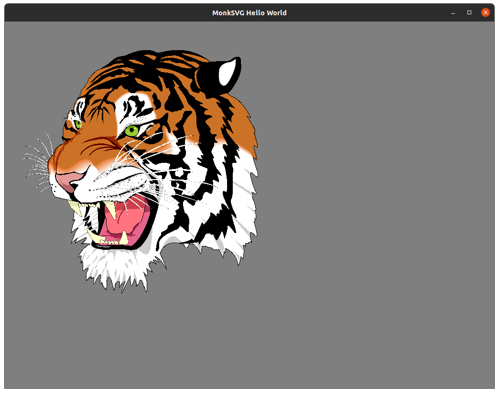

# MonkSVG


## Overview

MonkSVG is an SVG parsing and rendering library.  It is designed to use various vector graphics backends with the current backend implementation using [MonkVG](https://github.com/micahpearlman/MonkVG).

## Installation & Build

NOTE: It's important to use `--recursive` when when cloning to clone any submodules.

```
# Clone the project. USE `--recursive`
git clone --recursive git@github.com:micahpearlman/MonkSVG.git
cd MonkSVG

# Get the latest from the submodules
git submodule update --recursive --remote

# Build
mkdir build \
    && cd build \
    && cmake .. \
    &&  cmake --build . 

```
